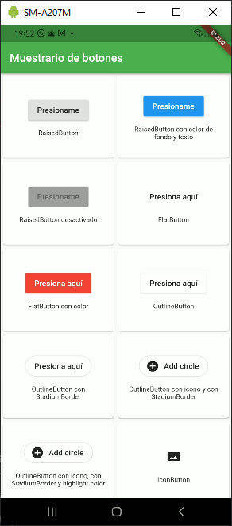
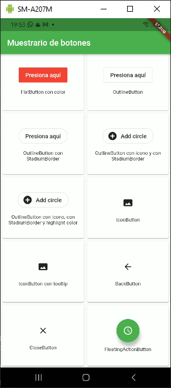

# __MUESTRARIO BOTONES__

Un proyecto de Flutter.

Elaborado por: @obed-peralta

Este proyecto muestra con claridad, los widgets de botones que pueden implementarse en una aplicación de flutter.

He incluído los botones **deprecados** a partir de la versión 1.26 de Flutter.

Aquí una vista previa:

